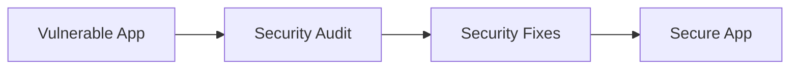

<div align="center">


<br><br>


<br>

</div>

---

## What is this?

A **Faculty Secure Portal** built twice: first full of real-world security mistakes, then rebuilt after a proper security audit. Put the two versions side by side and you can see exactly how an attack works and exactly how the fix stops it.



> [!WARNING]
> The vulnerable version is intentionally insecure. Run it only on your own machine for testing. Never deploy it.

---

## Vulnerable vs Secure

| Security Area | Vulnerable Version | Secure Version |
|:---|:---|:---|
| **Passwords** | Stored as plaintext | Hashed |
| **SQL Queries** | Injection risk | Parameterized queries |
| **CSRF** | No protection | Token validation |
| **OTP** | Stored as plaintext | Hashed |
| **File Upload** | Weak validation | Type, size and content checks |
| **Sessions** | Default settings | Secure cookies |
| **Rate Limiting** | Missing | Login and OTP throttling |
| **Security Headers** | Limited | Enabled |
| **Debug Mode** | Enabled | Disabled |
| **Secrets** | Weak fallback | Environment variables |

---

## See the Difference

<details>
<summary><b>SQL Injection: click to expand</b></summary>

<br>

```python
# Vulnerable: user input goes straight into the query
query = f"SELECT * FROM users WHERE username = '{username}'"

# Secure: parameterized query
db.execute("SELECT * FROM users WHERE username = ?", (username,))
```

Entering `' OR '1'='1` in the login form logs you in on the vulnerable version. The secure version rejects it.

</details>

---

## Tech Stack

| Layer | Technology |
|:---|:---|
| **Frontend** | HTML, CSS, JavaScript |
| **Backend** | Python, Flask |
| **Database** | SQLite |
| **Environment** | Local security lab |

---

## Project Structure

```
CodeAlpha-SecureWeb-App/
├── vulnerable/
│   ├── frontend/
│   └── backend/
│       └── v-app.py
└── secure/
    ├── frontend/
    └── backend/
        └── s-app.py
```

---

## Getting Started

```bash
# Clone the repo
git clone https://github.com/<your-username>/CodeAlpha-SecureWeb-App.git
cd CodeAlpha-SecureWeb-App

# Install dependencies
pip install flask

# Run the vulnerable version (local testing only)
python vulnerable/backend/v-app.py

# Run the secure version (set SECRET_KEY first)
export SECRET_KEY="your-long-random-secret"
python secure/backend/s-app.py
```

---

## Disclaimer

This project is for **educational and authorized security testing only**. The author is not responsible for misuse.
